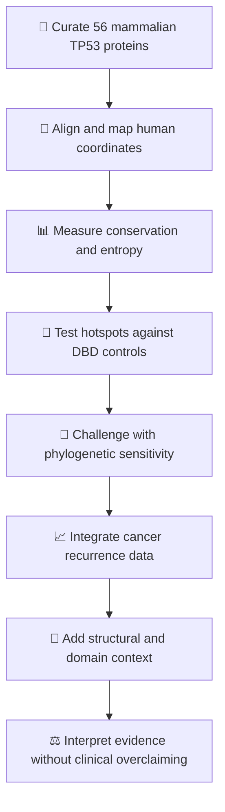
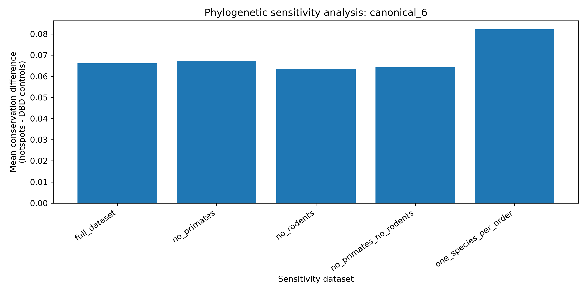

<a id="top"></a>

<div align="center">

# 🧬 TP53 Evolutionary Conservation Across Mammals

### *The residues evolution refused to change — and cancer repeatedly targets*

**Comparative genomics · Evolutionary oncology · Cancer bioinformatics · Reproducible research**

**Ritika Rajendra Rawat** · **Sermarani Nadar** · **Gursimran Kaur Uppal** · 2026

<br>

[](https://eccb2026.org/)
[](https://doi.org/10.21203/rs.3.rs-9299199/v1)
[](publication/MAIN_MANUSCRIPT_FINAL_SUBMISSION_READY.pdf)
[](CITATION.cff)

<br>

[](ritika.rawat27@outlook.comsubject=TP53%20Research%20Collaboration)
[](https://in.linkedin.com/in/ritika-rawat-551107219)
[](https://github.com/Rita1791)
[](https://www.researchgate.net/profile/Ritika-Rawat-10)

<br>

<a href="figures/main/Figure_5_TP53_Domain_Lollipop_Map.png">
  
</a>

<sub>👆 Click the map to open the full-resolution figure.</sub>

</div>

---

<div align="center">

## 🧭 Choose Your Route

| [🌍 **ECCB 2026**](#eccb-2026) | [🎯 **Key Results**](#key-results) | [🧪 **Research Journey**](#research-journey) |
|:---:|:---:|:---:|
| Conference presentation | What the analysis found | How the evidence was built |
| [🖼️ **Figure Gallery**](#figure-gallery) | [📂 **Open Files**](#open-the-research) | [🤝 **Connect**](#connect-with-the-researcher) |
| Explore visual evidence | Jump directly into data and code | Contact the lead researcher |

</div>

---

<a id="eccb-2026"></a>

## 🌍 Selected for ECCB 2026

> [!IMPORTANT]
> This research has been **selected for a poster presentation at ECCB 2026**, the **25th European Conference on Computational Biology**, taking place in **Geneva, Switzerland, from 31 August to 4 September 2026**. Lead researcher **Ms. Ritika Rajendra Rawat** will present the study as a scientific poster.

<div align="center">

[](https://eccb2026.org/)
[](https://eccb2026.org/programme)
[](eccb2026/)

</div>

| Conference detail | Information |
|---|---|
| 🏛️ Event | **25th European Conference on Computational Biology — ECCB 2026** |
| 📍 Location | **Geneva, Switzerland** |
| 📅 Dates | **31 August–4 September 2026** |
| 🖼️ Format | **Accepted poster presentation** |
| 👩‍🔬 Presenter | **Ms. Ritika Rajendra Rawat** |
| 🧬 Research | **Evolutionary Conservation and Functional Constraint of TP53 Mutation Hotspots Across Mammalian Species** |

<p align="right"><a href="#top">⬆ Back to top</a></p>

---

## ⚡ The Study in 30 Seconds

This project asks a focused question:

> ### Are recurrent human TP53 cancer hotspots located at residues that mammalian evolution strongly constrained?

A curated alignment of **56 mammalian TP53 protein sequences** was mapped to the **393-residue human reference**. All six canonical hotspots—**R175, G245, R248, R249, R273 and R282**—were invariant in the committed analysis. Yet **R249** ranked only nineteenth by pan-cancer mutation count.

That exception is the point: **conservation identifies functional constraint, but it does not fully explain how often cancer mutates a codon.**

<table>
  <tr>
    <td align="center" width="25%"><h2>56</h2><sub>mammalian TP53<br>sequences</sub></td>
    <td align="center" width="25%"><h2>6 / 6</h2><sub>canonical hotspots<br>fully conserved</sub></td>
    <td align="center" width="25%"><h2>0.02359</h2><sub>empirical one-sided<br>permutation P</sub></td>
    <td align="center" width="25%"><h2>0.430</h2><sub>reported Spearman ρ<br>across 393 residues</sub></td>
  </tr>
</table>

<a id="key-results"></a>

## 🎯 Key Results — Explore the Evidence

<details open>
<summary><strong>🧬 Result 1 — All six canonical hotspots are invariant</strong></summary>

<br>

| Hotspot | Functional class | Conservation | PanCancer mutations | Recurrence rank |
|---|---|---:|---:|---:|
| **R175** | Structural core | **1.000** | 167 | #3 |
| **G245** | Structural core | **1.000** | 91 | #6 |
| **R248** | DNA contact | **1.000** | 225 | #2 |
| **R249** | Structural core | **1.000** | 47 | **#19** |
| **R273** | DNA contact | **1.000** | 268 | #1 |
| **R282** | Structural core | **1.000** | 91 | #5 |

🔗 **Open the evidence:** [residue conservation table](data/processed/residue_conservation.csv) · [mutation dataset](data/raw/cbioportal_mutation_frequency_by_codon.csv) · [hotspot analysis](results/hotspot_analysis/TP53_hotspot_analysis.csv)

</details>

<details>
<summary><strong>📊 Result 2 — Hotspots exceed domain-matched controls</strong></summary>

<br>

Canonical hotspots show mean conservation of **1.000**, compared with **0.934** among non-hotspot residues from the same DNA-binding domain. The reported one-sided Mann–Whitney test gives **P = 0.0156**, while the committed matched permutation analysis gives empirical one-sided **P = 0.02359**.

🔗 **Open the evidence:** [comparison figure](figures/main/Figure_2_Hotspot_vs_Control_Boxplot.png) · [permutation statistics](results/statistics/permutation_hotspot_statistics.csv) · [statistical method](docs/statistical_analysis.md)

</details>

<details>
<summary><strong>🌳 Result 3 — The effect survives taxonomic sensitivity checks</strong></summary>

<br>

The hotspot–control contrast remains positive across lineage-removal and order-aware sensitivity analyses. This does not make related species statistically independent, but it shows that the direction of the result is not carried by one obvious lineage alone.

🔗 **Open the evidence:** [sensitivity figure](figures/main/Figure_3_Phylogenetic_Sensitivity.png) · [phylogeny](figures/main/Figure_6_Mammalian_TP53_Phylogeny_CLEAN.png) · [tree file](results/phylogeny/TP53_mammals.treefile)

</details>

<details>
<summary><strong>📈 Result 4 — Cancer recurrence and conservation are related, not identical</strong></summary>

<br>

Across 393 human-coordinate residues, the repository reports a positive association between mutation count and mammalian conservation: **Spearman ρ = 0.430; P = 4.49 × 10⁻¹⁹**. This is an association, not a causal model of tumour mutation frequency.

🔗 **Open the evidence:** [correlation figure](figures/main/Figure_4_Mutation_Count_vs_Conservation.png) · [mutation data](data/raw/cbioportal_mutation_frequency_by_codon.csv) · [interpretation](docs/result_interpretation_for_non_specialists.md)

</details>

<details>
<summary><strong>⚠️ Result 5 — R249 prevents the easy overclaim</strong></summary>

<br>

**R249 is perfectly conserved across the mammalian alignment but ranks only nineteenth by mutation count.** Evolutionary conservation measures long-term protein constraint. Cancer recurrence also depends on nucleotide context, mutational exposure, tumour type, tissue environment, clonal fitness and cohort ascertainment.

| Conservation can support | Conservation cannot determine alone |
|---|---|
| Functional importance of a residue | Exposure to a specific mutational process |
| Long-term intolerance to amino-acid change | Tumour-type-specific selection |
| Prioritisation for functional investigation | Clinical risk, prognosis or treatment response |

🔗 **Read the boundary:** [scientific interpretation](docs/result_interpretation_for_non_specialists.md) · [limitations](docs/interpretation_and_limitations.md)

</details>

<p align="right"><a href="#top">⬆ Back to top</a></p>

---

<a id="research-journey"></a>

## 🧪 Research Journey



### 🔎 Follow Each Stage into the Repository

| Stage | What happens | Open the file |
|---:|---|---|
| 01 · 🧬 | Curate sequences and verify accessions | [`TP53_curated.fasta`](data/processed/TP53_curated.fasta) · [`accession audit`](data/processed/TP53_sequence_accession_audit.csv) |
| 02 · 🧭 | Align proteins and map them to the human reference | [`alignment script`](scripts/01_align_sequences.sh) · [`methodology`](docs/methodology.md) |
| 03 · 📊 | Calculate conservation, entropy and gap-aware residue statistics | [`conservation script`](scripts/conservation_analysis.py) · [`residue table`](data/processed/residue_conservation.csv) |
| 04 · 🎯 | Compare canonical hotspots with DNA-binding-domain controls | [`hotspot script`](scripts/hotspot_analysis.py) · [`hotspot results`](results/hotspot_analysis/TP53_hotspot_analysis.csv) |
| 05 · 🎲 | Evaluate the hotspot effect statistically | [`permutation script`](scripts/permutation_analysis.py) · [`statistics`](results/statistics/permutation_hotspot_statistics.csv) |
| 06 · 🌳 | Reconstruct phylogeny and test taxonomic sensitivity | [`phylogenetic script`](scripts/phylogenetic_analysis.py) · [`tree`](results/phylogeny/TP53_mammals.treefile) |
| 07 · 📈 | Integrate pan-cancer mutation recurrence | [`mutation script`](scripts/mutation_analysis.py) · [`cBioPortal table`](data/raw/cbioportal_mutation_frequency_by_codon.csv) |
| 08 · 📝 | Interpret, document and communicate the evidence | [`reviewer summary`](docs/reviewer_summary.md) · [`manuscript`](publication/MAIN_MANUSCRIPT_FINAL_SUBMISSION_READY.pdf) |

<details>
<summary><strong>🔬 Expand the complete analytical design</strong></summary>

1. Curate mammalian TP53 protein sequences with accession-level traceability.
2. Align sequences with MAFFT and anchor positions to the human TP53 reference.
3. Calculate majority-residue conservation, human-residue conservation, Shannon entropy and gap statistics.
4. Confirm the expected human residues at R175, G245, R248, R249, R273 and R282.
5. Compare the canonical hotspots with non-hotspot residues from the same DNA-binding domain.
6. Evaluate the hotspot mean using one-sided Mann–Whitney and matched permutation tests.
7. Repeat the hotspot–control comparison across taxonomic sensitivity subsets.
8. Integrate TCGA PanCancer/cBioPortal mutation counts at human TP53 codons.
9. Add domain, structural-class and maximum-likelihood phylogenetic context.
10. Separate observed evidence from causal and clinical claims.

📚 Full documentation: [methodology](docs/methodology.md) · [statistics](docs/statistical_analysis.md) · [provenance](docs/provenance.md) · [reproducibility](docs/reproducibility.md)

</details>

---

<a id="figure-gallery"></a>

## 🖼️ Interactive Figure Gallery

> Click any figure to open the original high-resolution image. PDF versions are available in the same [`figures/main/`](figures/main/) directory.

<table>
  <tr>
    <td width="50%" align="center">
      <a href="figures/main/Figure_1_Conservation_Profile.png">
        
      </a><br>
      <strong>01 · 🧬 Conservation landscape</strong><br>
      <sub>Where mammalian TP53 is preserved—and where it varies.</sub>
    </td>
    <td width="50%" align="center">
      <a href="figures/main/Figure_2_Hotspot_vs_Control_Boxplot.png">
        
      </a><br>
      <strong>02 · 🎯 Hotspots versus controls</strong><br>
      <sub>Domain-matched comparison of evolutionary constraint.</sub>
    </td>
  </tr>
  <tr>
    <td width="50%" align="center">
      <a href="figures/main/Figure_3_Phylogenetic_Sensitivity.png">
        
      </a><br>
      <strong>03 · 🌳 Phylogenetic sensitivity</strong><br>
      <sub>Testing whether taxonomic composition drives the signal.</sub>
    </td>
    <td width="50%" align="center">
      <a href="figures/main/Figure_4_Mutation_Count_vs_Conservation.png">
        
      </a><br>
      <strong>04 · 📈 Recurrence versus conservation</strong><br>
      <sub>Related biological signals, but not the same signal.</sub>
    </td>
  </tr>
  <tr>
    <td width="50%" align="center">
      <a href="figures/main/Figure_5_TP53_Domain_Lollipop_Map.png">
        
      </a><br>
      <strong>05 · 🧩 Structural domain map</strong><br>
      <sub>Recurrent mutations across the TP53 protein architecture.</sub>
    </td>
    <td width="50%" align="center">
      <a href="figures/main/Figure_6_Mammalian_TP53_Phylogeny_CLEAN.png">
        
      </a><br>
      <strong>06 · 🌿 Mammalian phylogeny</strong><br>
      <sub>Evolutionary context for the 56-sequence dataset.</sub>
    </td>
  </tr>
</table>

<div align="center">

[](figures/main/)
[](figures/supplementary/)
[](figures/README.md)

</div>

<p align="right"><a href="#top">⬆ Back to top</a></p>

---

<a id="open-the-research"></a>

## 📂 Open the Research

### Pick What You Need

| I want to… | Start here | Direct route |
|---|---|---|
| ⚡ Understand the result quickly | Reviewer summary | [`docs/reviewer_summary.md`](docs/reviewer_summary.md) |
| 🧠 Read a non-specialist explanation | Result interpretation | [`docs/result_interpretation_for_non_specialists.md`](docs/result_interpretation_for_non_specialists.md) |
| 🧪 Examine the complete method | Methodology | [`docs/methodology.md`](docs/methodology.md) |
| 📊 Inspect statistical reasoning | Statistical analysis | [`docs/statistical_analysis.md`](docs/statistical_analysis.md) |
| 🧬 Inspect curated sequences | Processed data | [`data/processed/`](data/processed/) |
| 💻 Audit the implementation | Analysis scripts | [`scripts/`](scripts/) |
| 🌳 Open the phylogenetic output | Tree results | [`results/phylogeny/`](results/phylogeny/) |
| 🖼️ Download publication figures | Figure collection | [`figures/`](figures/) |
| 📘 Read the manuscript | Publication PDF | [`MAIN_MANUSCRIPT_FINAL_SUBMISSION_READY.pdf`](publication/MAIN_MANUSCRIPT_FINAL_SUBMISSION_READY.pdf) |
| 🌍 View conference materials | ECCB 2026 area | [`eccb2026/`](eccb2026/) |
| ✍️ Cite the project | Citation metadata | [`CITATION.cff`](CITATION.cff) |
| ⚠️ Check limitations first | Interpretation boundaries | [`docs/interpretation_and_limitations.md`](docs/interpretation_and_limitations.md) |

### Repository Map

```text
TP53-Evolutionary-Conservation-Mammals/
├── 🧬 data/          Curated sequences, provenance and processed evidence
├── 💻 scripts/       Conservation, hotspot, mutation and phylogeny analyses
├── 📊 results/       Committed output tables and phylogenetic files
├── 🖼️ figures/       Main and supplementary publication graphics
├── 📚 docs/          Methods, statistics, review notes and limitations
├── 📘 publication/   Manuscript, supplementary material and LaTeX sources
├── 🌍 eccb2026/      Conference poster-presentation materials
├── 📓 notebooks/     Exploratory and integrated analyses
└── ✍️ CITATION.cff   Machine-readable citation metadata
```

<details>
<summary><strong>💻 Clone and inspect the repository</strong></summary>

```bash
git clone https://github.com/Rita1791/TP53-Evolutionary-Conservation-Mammals.git
cd TP53-Evolutionary-Conservation-Mammals

python -m venv .venv
source .venv/bin/activate
python -m pip install --upgrade pip
python -m pip install -r requirement.txt
```

> [!NOTE]
> The repository supports evidence inspection and modular analysis. It should not yet be described as a verified one-command clean rebuild because the end-to-end script, tests and output schemas still require reconciliation.

</details>

---

## 🔍 Scientific Boundaries

| ✅ Supported by this study | ❌ Not established by this study |
|---|---|
| Strong mammalian conservation at six canonical hotspots | That conservation causes a cancer mutation |
| Greater reported hotspot conservation than DBD controls | Personal cancer risk or diagnostic classification |
| Positive association between recurrence and conservation | Prognosis, treatment response or clinical utility |
| Positive direction across taxonomic sensitivity analyses | Statistical independence of 56 related species |
| R249 as evidence that recurrence needs more explanation | A complete codon-level mutational model |

<details>
<summary><strong>⚠️ Read the limitations and reproducibility status</strong></summary>

The study uses protein-sequence conservation rather than a codon-aware evolutionary model. Mammalian orders are unevenly represented. TCGA PanCancer/cBioPortal counts reflect available cohorts rather than universal mutation probabilities. Structural interpretation is class-based and should be extended with experimental structure, stability and DNA-contact evidence. The outputs are **not validated for clinical decision-making**.

The repository also contains known reproducibility gaps: some path and schema assumptions differ between scripts, tests and committed outputs; exact software versions and input checksums are not fully locked; and the current pipeline should not be advertised as a verified one-command rebuild.

🔗 Read: [full limitations](docs/interpretation_and_limitations.md) · [reproducibility record](docs/reproducibility.md) · [provenance](docs/provenance.md)

</details>

<details>
<summary><strong>🗂️ Understand the 10-species and 56-sequence versions</strong></summary>

The linked Research Square preprint records an earlier **10-species analysis**. The current repository contains an expanded **56-sequence analysis**. Their sample sizes and numerical results must not be mixed.

| Evidence snapshot | Scope | Correct use |
|---|---|---|
| Research Square preprint v1 | Earlier 10-species analysis | Cite as the frozen published record |
| Current repository analysis | Expanded 56-sequence analysis | Use for committed repository tables and figures |

🔗 Read the reconciliation rule: [`docs/analysis_versions.md`](docs/analysis_versions.md)

</details>

---

## 📖 Publication & Citation

**Rawat, R. R., Nadar, S., & Uppal, G. K. (2026).**  
*Evolutionary Conservation and Functional Constraint of TP53 Mutation Hotspots Across Mammalian Species.*  
Research Square. [https://doi.org/10.21203/rs.3.rs-9299199/v1](https://doi.org/10.21203/rs.3.rs-9299199/v1)

<div align="center">

[](https://doi.org/10.21203/rs.3.rs-9299199/v1)
[](publication/MAIN_MANUSCRIPT_FINAL_SUBMISSION_READY.pdf)
[](CITATION.cff)

</div>

<details>
<summary><strong>📋 Copy the BibTeX citation</strong></summary>

```bibtex
@article{rawat2026tp53,
  author  = {Rawat, Ritika Rajendra and Nadar, Sermarani and Uppal, Gursimran Kaur},
  title   = {Evolutionary Conservation and Functional Constraint of TP53 Mutation Hotspots Across Mammalian Species},
  year    = {2026},
  journal = {Research Square},
  doi     = {10.21203/rs.3.rs-9299199/v1},
  url     = {https://doi.org/10.21203/rs.3.rs-9299199/v1}
}
```

</details>

---

## 👩‍🔬 Research Team

| Researcher | Contribution |
|---|---|
| **Ritika Rajendra Rawat** | Study conception, computational workflow, sequence curation, comparative analysis, phylogenetics, cancer-data integration, visualisation, interpretation and manuscript drafting |
| **Sermarani Nadar** | Scientific discussion, interpretation, critical review and manuscript approval |
| **Gursimran Kaur Uppal** | Scientific discussion, interpretation, critical review and manuscript approval |

<a id="connect-with-the-researcher"></a>

## 🤝 Connect with the Researcher

<div align="center">

### Ritika Rajendra Rawat

**Bioinformatics researcher working across comparative genomics, evolutionary oncology, computational biology and evidence-aware genomic analysis.**

Interested in research collaboration, conference discussion, computational genomics, TP53 biology or reproducible bioinformatics? Use the direct route that matches your purpose:

<br>

[](mailto:ritikarvl2627@gmail.com?subject=TP53%20Research%20Collaboration)
[](https://in.linkedin.com/in/ritika-rawat-551107219)
[](https://github.com/Rita1791)
[](https://www.researchgate.net/profile/Ritika-Rawat-10)

<br>

| Purpose | Direct action |
|---|---|
| 🤝 Research collaboration | [Send a collaboration email](mailto:ritikarvl2627@gmail.com?subject=TP53%20Research%20Collaboration) |
| 💼 Professional networking | [Connect on LinkedIn](https://in.linkedin.com/in/ritika-rawat-551107219) |
| 💻 Code and project portfolio | [Visit GitHub profile](https://github.com/Rita1791) |
| 🔬 Publications and research updates | [Follow on ResearchGate](https://www.researchgate.net/profile/Ritika-Rawat-10) |
| 🐛 Technical question about this repository | [Open a GitHub issue](https://github.com/Rita1791/TP53-Evolutionary-Conservation-Mammals/issues/new) |

</div>

---

## 📜 License

Code and repository material are released under the [MIT License](LICENSE). Third-party biological data and external resources retain their original terms of use.

---

<div align="center">

### 🧬 Evolutionary conservation is the evidence trail.

## ⚠️ R249 is the reminder not to oversimplify it.

[🌍 ECCB 2026](#eccb-2026) · [🎯 Results](#key-results) · [🖼️ Figures](#figure-gallery) · [📂 Files](#open-the-research) · [🤝 Connect](#connect-with-the-researcher) · [⬆ Back to top](#top)

<sub>Comparative-genomics research · Not validated for clinical use</sub>

</div>
