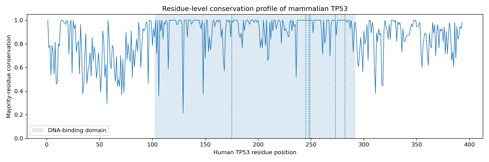
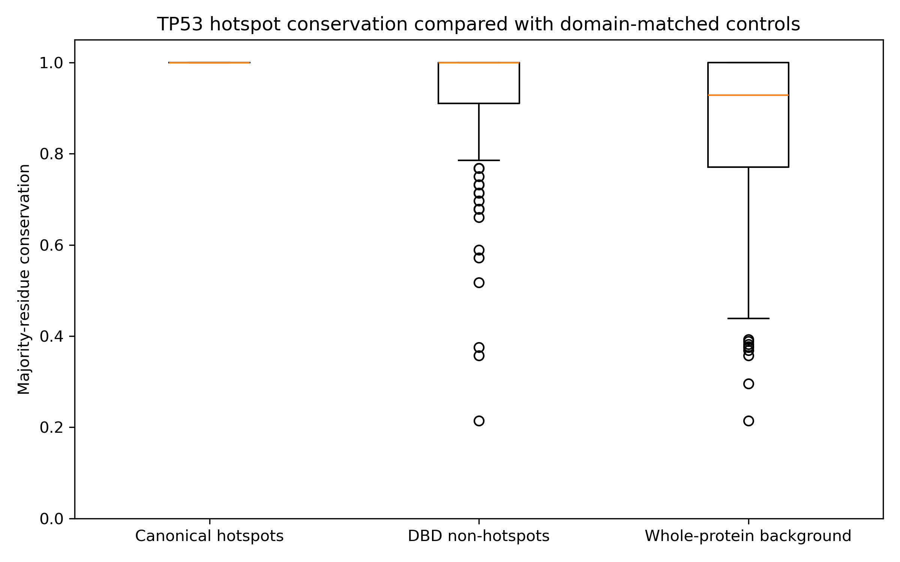
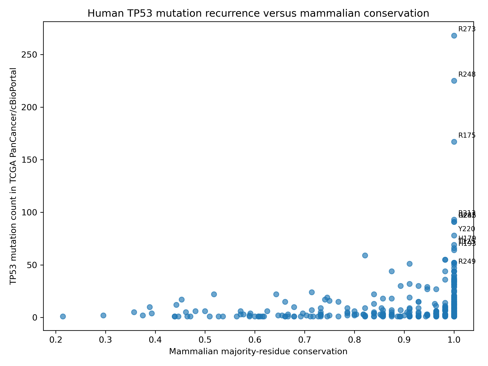
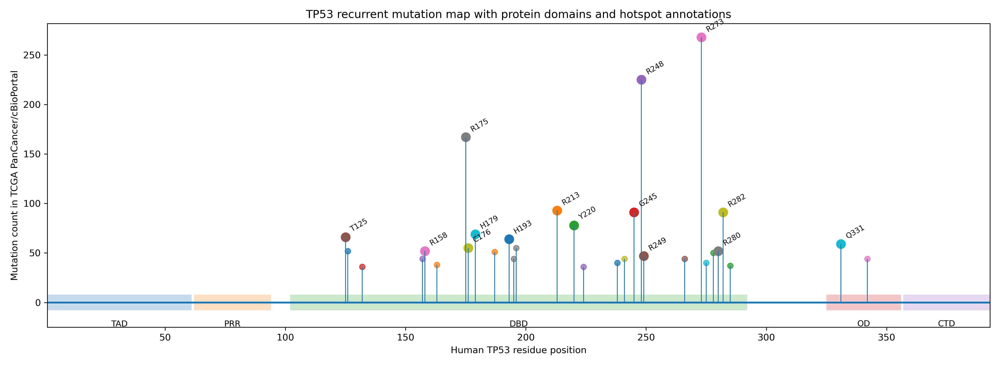

🧬 TP53 Across Mammalian Evolution

Where evolutionary constraint meets recurrent human cancer mutation

  <strong>56 mammalian TP53 sequences</strong> · <strong>393 human residues</strong> · <strong>6 canonical hotspots</strong> 
  comparative genomics + cancer recurrence + phylogenetic sensitivity + structural context

 

The headline: all six canonical hotspots are invariant.The nuance: conservation alone does not explain why every hotspot recurs at the same frequency.

 

🎯 Question · 🧪 Workflow · 📊 Results · 🧭 Explore · 🚀 Start · ⚠️ Boundaries

[!IMPORTANT]This repository contains an expanded 56-sequence analysis. The associated Research Square preprint describes an earlier 10-species analysis. These are related but non-identical evidence snapshots; their sample sizes and statistics must not be mixed.

The question

Human cancers repeatedly mutate a small set of TP53 codons. Mammalian evolution has independently tested those same positions across millions of years.

This project asks:

Do recurrent human TP53 cancer-mutation hotspots occur at amino-acid positions that are unusually constrained across mammals?

The analysis focuses on six canonical hotspots:

R175 · G245 · R248 · R249 · R273 · R282

The goal is not to argue that conservation causes mutation recurrence. It is to test whether evolutionary constraint and cancer recurrence converge at the same residue-level positions—and to identify where that relationship breaks down.

The result in 60 seconds

<table>
  <tr>
    <td align="center" width="25%"><strong>56</strong> curated mammalian TP53 sequences</td>
    <td align="center" width="25%"><strong>6 / 6</strong> canonical hotspots fully conserved</td>
    <td align="center" width="25%"><strong>0.0236</strong> committed empirical permutation P</td>
    <td align="center" width="25%"><strong>ρ = 0.430</strong> reported mutation– conservation association</td>
  </tr>
</table>

All six canonical hotspots have human-residue conservation = 1.000, Shannon entropy = 0, and no alignment gaps in the committed residue table.

The manuscript reports higher canonical-hotspot conservation than DNA-binding-domain non-hotspot controls: 1.000 vs 0.934; one-sided Mann–Whitney P = 0.0156.

The committed canonical DBD-matched permutation result reports empirical one-sided P = 0.02359.

Across all 393 TP53 residues, the manuscript reports a positive association between mutation count and majority-residue conservation: Spearman ρ = 0.430; P = 4.49 × 10⁻¹⁹.

Five canonical hotspots rank among the six most recurrent codons in the committed cancer-mutation table. R249 is the exception: completely conserved, but only nineteenth by recurrence.

[!TIP]Evolutionary constraint marks functional importance; it does not fully determine cancer-mutation frequency.

The study in one view

flowchart TB
    A["Curated mammalian TP53 proteins"] --> B["MAFFT multiple-sequence alignment"]
    B --> C["Map alignment to human TP53 positions"]
    C --> D["Residue conservation + entropy"]
    D --> E{"Three evidence lenses"}
    E --> F["Canonical hotspots vs DBD controls"]
    E --> G["Cancer mutation recurrence"]
    E --> H["Phylogeny + sensitivity subsets"]
    F --> I["Integrated evolutionary interpretation"]
    G --> I
    H --> I

<strong>🔬 Open the analytical logic in plain language</strong>

Curate mammalian TP53 protein sequences with accession-level traceability.

Align sequences with MAFFT and anchor coordinates to the 393-residue human reference.

Calculate majority-residue conservation, human-residue conservation, entropy, and gap statistics.

Validate the expected amino acid at each canonical hotspot.

Compare hotspot conservation with non-hotspot residues from the same DNA-binding domain.

evaluate enrichment with one-sided Mann–Whitney and matched permutation tests.

Integrate TCGA PanCancer/cBioPortal codon-level mutation recurrence.

test robustness after removing overrepresented lineages and downsampling by mammalian order.

add maximum-likelihood phylogenetic and structural-class context.

interpret the pattern as computational evidence—not causal or clinical proof.

Evidence at the six canonical hotspots

Hotspot

Structural role

Mammalian conservation

Shannon entropy

PanCancer mutations

Recurrence rank

R175

Structural core

1.000

0.000

167

3

G245

Structural core

1.000

0.000

91

6

R248

DNA contact

1.000

0.000

225

2

R249

Structural core

1.000

0.000

47

19

R273

DNA contact

1.000

0.000

268

1

R282

Structural core

1.000

0.000

91

5

Sources: residue_conservation.csv, cbioportal_mutation_frequency_by_codon.csv, and the manuscript source.

Why R249 matters

R249 prevents an overly simple conclusion.

complete mammalian conservation ≠ guaranteed top-ranked cancer recurrence

Its lower pan-cancer rank suggests that mutation exposure, tumour type, sequence context, and selection can influence recurrence in addition to functional constraint. In other words, conservation identifies an important site; it does not predict the whole epidemiology of that mutation.

Four complementary tests

Test

What it asks

Primary signal

Domain-matched comparison

Are hotspots more conserved than other DNA-binding-domain residues?

Reported mean: 1.000 vs 0.934; P = 0.0156

Permutation analysis

Is the hotspot mean unusual under size-matched DBD sampling?

Committed empirical P = 0.02359

Mutation–conservation correlation

Do more recurrent codons tend to be more conserved?

Reported Spearman ρ = 0.430 across 393 residues

Phylogenetic sensitivity

Does the signal survive changes in taxonomic composition?

Positive effect retained across all reported subsets

[!NOTE]The six hotspots form a small, tied group at the maximum conservation value. P-values should therefore be read alongside effect size, control definition, dataset version, and biological context—not as standalone proof.

Visual evidence

<table>
  <tr>
    <td width="50%" align="center">
      
       <strong>Figure 1.</strong> Conservation landscape across human TP53 coordinates
    </td>
    <td width="50%" align="center">
      
       <strong>Figure 2.</strong> Canonical hotspots versus matched controls
    </td>
  </tr>
  <tr>
    <td width="50%" align="center">
      
       <strong>Figure 4.</strong> Cancer recurrence meets mammalian constraint
    </td>
    <td width="50%" align="center">
      
       <strong>Figure 5.</strong> Recurrent codons in TP53 domain context
    </td>
  </tr>
</table>

<strong>🌳 View the phylogenetic layer</strong>

 

  
   <strong>Figure 6.</strong> Maximum-likelihood mammalian TP53 phylogeny

The manuscript reports an IQ-TREE reconstruction with the ModelFinder-selected Q.bird+I+G4 model, 1,000 ultrafast bootstrap replicates, and 1,000 SH-aLRT replicates. The tree provides evolutionary context; it does not make the 56 species statistically independent.

Dataset and coordinate system

Component

Repository setting

Human reference

NP_001394193, 393 amino acids

Expanded dataset

56 mammalian TP53 protein sequences

Mammalian orders

15 represented in the accession audit

Canonical hotspots

R175, G245, R248, R249, R273, R282

Primary control

Non-hotspot residues within the TP53 DNA-binding domain

Conservation metrics

Majority residue, human residue, Shannon entropy, normalized entropy, gaps

Cancer data

TCGA PanCancer-derived codon-level export through cBioPortal

Phylogeny

IQ-TREE maximum-likelihood reconstruction

Structural context

DNA-contact and structural-core hotspot classes

All 56 entries are marked PASS in TP53_sequence_accession_audit.csv. Dataset provenance and curation boundaries are documented in docs/provenance.md.

Choose your route

If you are a…

Start here

What you will find

New reader

docs/result_interpretation_for_non_specialists.md

Biological meaning without heavy statistics

PI or reviewer

docs/reviewer_summary.md

Question, dataset, evidence, and limitations

Methods reviewer

docs/methodology.md

Comparative and statistical design

Statistical reviewer

docs/statistical_analysis.md

Hypotheses, controls, permutation logic, and effect sizes

Provenance auditor

docs/provenance.md

Sources, accessions, curation, and external datasets

Reproducibility reviewer

docs/reproducibility.md

Intended execution chain and dependencies

Critical reader

docs/interpretation_and_limitations.md

Evidentiary boundaries and failure modes

Version auditor

docs/analysis_versions.md

10-species preprint versus 56-sequence repository analysis

Developer

scripts/ and tests/

Current implementation and contract checks

Quick start

1. Clone the repository

git clone https://github.com/Rita1791/TP53-Evolutionary-Conservation-Mammals.git
cd TP53-Evolutionary-Conservation-Mammals

2. Create a Python environment

python -m venv .venv
source .venv/bin/activate
python -m pip install --upgrade pip
python -m pip install -r requirement.txt

[!NOTE]The repository currently uses the filename requirement.txt, not the more common requirements.txt.

3. Inspect the committed evidence

python - <<'PY'
import pandas as pd

conservation = pd.read_csv("data/processed/residue_conservation.csv")
hotspots = conservation[conservation["is_canonical_hotspot"] == True]

print(
    hotspots[
        [
            "human_position",
            "human_residue",
            "human_residue_conservation",
            "shannon_entropy",
            "gap_count",
        ]
    ].to_string(index=False)
)
PY

4. Re-run the current permutation module

python scripts/permutation_analysis.py \
  --iterations 100000 \
  --seed 42 \
  --output permutation_check.csv

This module executes independently from the committed conservation and mutation tables. However, its present metric selection does not exactly reproduce every value in the committed permutation CSV; see the reproducibility dashboard below.

Repository anatomy

TP53-Evolutionary-Conservation-Mammals/
├── data/
│   ├── raw/                 # Structural, mutation, metadata, and source records
│   └── processed/           # Curated FASTA, accession audit, conservation tables
├── scripts/                 # Alignment and analytical modules
├── tests/                   # Conservation and output-contract checks
├── results/                 # Hotspot, statistics, mutation, and phylogeny outputs
├── figures/
│   ├── main/                # Six publication figures
│   └── supplementary/       # Three supplementary figures
├── docs/                    # Methods, provenance, versions, and limitations
├── notebooks/               # Exploratory and integrated analyses
├── publication/             # Manuscript source and submitted PDFs
├── eccb2026/                # Conference-material area
├── CITATION.cff
└── requirement.txt

Reproducibility dashboard

Capability

Status

Honest interpretation

Inspect the 56-sequence accession audit

✅

Ready

Inspect the 393-residue conservation table

✅

Ready

Inspect committed figures and manuscript source

✅

Ready

Run the standalone permutation module

✅

Executes with NumPy and pandas

Reproduce the committed permutation table exactly

🟡

Metric/provenance reconciliation is still required

Rebuild the MAFFT alignment

🟡

Requires external MAFFT installation

Run scripts/run_pipeline.sh cleanly end to end

❌

Current script schemas and file paths are inconsistent

Run the committed tests cleanly

❌

Test imports and result-contract columns do not match current files

Treat results as clinical evidence

❌

Not validated for diagnosis, prognosis, or treatment

<strong>🧱 Known technical gaps found in the current repository</strong>

docs/reviewer_summary.md refers to environment.yml, but that file is not present.

The alignment step writes data/processed/TP53_aligned.fasta, while conservation_analysis.py currently reads TP53_curated.fasta.

The curated FASTA contains unequal, ungapped sequence lengths; it is not itself a multiple-sequence alignment.

conservation_analysis.py currently emits a schema that does not match the committed residue_conservation.csv or downstream hotspot script.

tests/test_conservation_analysis.py imports functions absent from the current conservation module.

tests/test_result_contract.py requires iterations and seed, but those columns are absent from the committed permutation CSV.

A seed-42 rerun of the current permutation script uses human_residue_conservation and does not reproduce the committed null mean derived from the majority-conservation analysis.

Several README paths in the present repository point to files that do not exist, including requirements.txt and canonical_hotspot_conservation.csv.

These are software-reproducibility defects, not evidence that the committed biological results are false. They do mean that a clean-clone, one-command reproduction claim would currently be inaccurate.

What this study does—and does not show

✅ Supported interpretation

❌ Unsupported interpretation

Canonical hotspots are invariant in the committed 56-sequence table

Conservation causes hotspot mutation

Hotspots show elevated conservation under reported DBD-matched analyses

Every conserved residue is a cancer hotspot

Mutation recurrence and conservation are positively associated

Conservation alone predicts recurrence

The pattern survives reported taxonomic sensitivity analyses

Species are independent statistical replicates

R249 exposes context beyond conservation

R249 proves one specific molecular mechanism

Results motivate structural and experimental hypotheses

Results establish clinical risk or treatment response

[!WARNING]This is a computational evolutionary-bioinformatics study. It is not a diagnostic test, pathogenicity classifier, therapeutic recommendation system, or experimental validation of TP53 function across species.

Two analyses, one project

Version

Scope

Correct use

Preprint v1

Earlier 10-species study

Cite and interpret as the frozen published snapshot

Repository analysis

Expanded 56-sequence study

Use for the current committed tables, figures, and sensitivity work

Do not silently replace preprint numbers with repository numbers. See docs/analysis_versions.md for the version rule.

Frequently asked questions

<strong>Does complete conservation mean these mutations cause cancer?</strong>

No. Complete conservation supports strong evolutionary constraint at these positions. Cancer causality and molecular mechanism require independent functional, structural, cellular, and clinical evidence.

<strong>Why compare hotspots with DNA-binding-domain controls?</strong>

All six canonical hotspots lie within a highly conserved domain. Comparing them only with the full protein would create an easier but less informative contrast. The domain-matched background asks whether the hotspots are unusual even within the structured TP53 core.

<strong>Why is R249 less recurrent despite complete conservation?</strong>

Conservation captures functional constraint, not exposure to mutational processes or tumour-specific selection. R249 therefore acts as an informative exception showing that recurrence is multifactorial.

<strong>Are the 56 species independent observations?</strong>

No. Species share evolutionary history. The repository uses sensitivity subsets to test whether the result is driven by taxonomic overrepresentation, but that does not erase phylogenetic dependence.

<strong>Can the full repository be reproduced with one command?</strong>

Not in its current state. The committed evidence can be inspected, and individual modules can run, but the end-to-end pipeline and tests require code/schema reconciliation before a clean reproduction claim is justified.

Roadmap

Add and pin a complete environment.yml or rename and lock requirement.txt.

Make the conservation module consume the MAFFT alignment and map human coordinates explicitly.

Reconcile script outputs with the committed conservation-table schema.

Regenerate permutation results from one declared metric and store seed/iterations.

Repair the test imports and make result-contract tests pass in CI.

Add checksums for source FASTA, alignment, mutation export, and final tables.

Record exact MAFFT, IQ-TREE, Python, and package versions.

Tag the reconciled 56-sequence workflow as a versioned release.

Expand phylogeny-aware statistics beyond sensitivity subset removal.

Add independent experimental or functional validation where feasible.

Research outputs

Associated preprint

Rawat, R. R., Nadar, S., & Uppal, G. K. (2026).Evolutionary Conservation and Functional Constraint of TP53 Mutation Hotspots Across Mammalian Species.Research Square. https://doi.org/10.21203/rs.3.rs-9299199/v1

Repository citation

Use the machine-readable metadata in CITATION.cff. GitHub can expose it through Cite this repository once the citation file is valid and complete.

[!CAUTION]The current CITATION.cff contains a placeholder ORCID value (https://orcid.org/). Replace it with a valid ORCID or remove the field before treating the citation metadata as final.

Research team

Ritika Rajendra RawatStudy design · Dataset curation · Computational workflow · Statistical analysis · Phylogenetics · Cancer-data integration · Visualization · Interpretation · Manuscript drafting

Sermarani NadarCo-author of the associated research

Gursimran Kaur UppalCo-author of the associated research

Connect

Platform

Link

GitHub

Rita1791

LinkedIn

Ritika Rawat

ResearchGate

Ritika Rawat

Email

ritika.rawat27@outlook.com

License

Released under the MIT License.

🧬 The most useful result is not simply that hotspots are conserved.

It is that conservation and recurrence overlap strongly—without being identical.

Built to turn residue-level observations into traceable evolutionary hypotheses.

